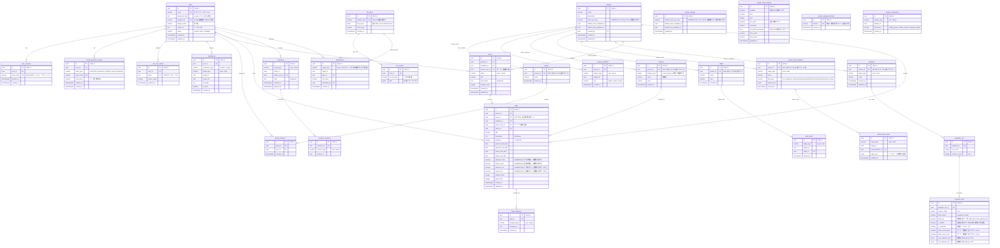

# Polaris データベース設計・ER図

すべてのテーブルは自動採番（SERIAL / IDENTITY）を使用せず、アプリケーション側で生成した **UUID v7**（`UUID` 型）を主キー（`id`）として使用します。日時はすべて `TIMESTAMPTZ`（UTC）で保持します。

## ER図（全体構造）

```mermaid
erDiagram
    users ||--o{ user_sessions : "has"
    users ||--o{ email_verification_tokens : "has"
    users ||--o{ user_fcm_tokens : "registers"
    users ||--o{ notifications : "receives"
    users ||--o{ group_members : "belongs_to"
    users ||--o{ issues : "owns"
    users ||--o{ tasks : "owns"
    users ||--o{ comments : "authors"
    users ||--o{ attachments : "uploads"

    groups ||--o{ group_members : "contains"
    projects ||--o{ groups : "defines_local"
    projects ||--o{ project_members : "has_members"
    projects ||--o{ statuses : "defines_statuses"
    projects ||--o{ labels : "defines_labels"
    projects ||--o{ custom_field_definitions : "defines_fields"
    projects ||--o{ templates : "defines_templates"
    projects ||--o{ issues : "contains"
    projects ||--o{ tasks : "contains"

    templates ||--o{ template_rows : "has_rows"
    template_rows ||--o{ template_fields : "has_fields"

    issues ||--|{ tasks : "parent_of"
    statuses ||--o{ tasks : "assigned_to"
    tasks ||--o{ task_assignees : "assigned_to"

    labels ||--o{ item_labels : "tagged_with"
    custom_field_definitions ||--o{ custom_field_values : "stores_value"

    file_blobs ||--|{ file_chunks : "split_into"
    file_blobs ||--o{ attachments : "referenced_by"

    comments ||--o{ comment_mentions : "mentions"

    users {
        uuid id PK "UUID v7"
        varchar email UK "ログインメールアドレス"
        text password_hash "bcryptハッシュ(NULL許容)"
        varchar google_sub UK "Google連携識別子(NULL許容)"
        varchar display_name "表示名"
        text avatar_url "アイコンURL"
        varchar status "invited / active / disabled"
        timestamptz created_at
        timestamptz updated_at
    }

    user_sessions {
        uuid id PK "UUID v7"
        uuid user_id FK
        varchar token_hash UK "SHA-256セッショントークンハッシュ"
        timestamptz expires_at
        timestamptz created_at
    }

    email_verification_tokens {
        uuid id PK "UUID v7"
        uuid user_id FK
        varchar token_type "invite(72h) / password_reset(1h) / email_change(1h)"
        varchar token_hash UK
        varchar new_email "メール変更時のみ"
        timestamptz expires_at
        timestamptz created_at
    }

    system_settings {
        uuid id PK "UUID v7"
        numeric default_hours_per_day "NUMERIC(4,2) 1.00〜24.00 (初期値8.00, 小数第2位まで)"
        uuid default_issue_template_id
        uuid default_task_template_id
        timestamptz updated_at
    }

    system_smtp_settings {
        uuid id PK "UUID v7"
        boolean enabled "外部SMTP使用フラグ"
        varchar host
        integer port
        boolean use_auth "認証有無フラグ"
        varchar username
        text encrypted_password "AES-GCM暗号化パスワード"
        varchar from_email
        varchar from_name
        timestamptz updated_at
    }

    system_allowed_domains {
        uuid id PK "UUID v7"
        varchar domain UK "末尾一致判定用ドメイン(最大10件)"
        timestamptz created_at
    }

    user_fcm_tokens {
        uuid id PK "UUID v7"
        uuid user_id FK
        text token UK "FCMデバイストークン"
        varchar device_name
        timestamptz updated_at
    }

    notifications {
        uuid id PK "UUID v7"
        uuid user_id FK
        varchar notification_type "mention / assign"
        varchar target_type "issue / task"
        uuid target_id
        uuid project_id
        text message
        boolean is_read
        timestamptz created_at
    }

    groups {
        uuid id PK "UUID v7"
        uuid project_id FK "NULLならシステム全体グループ"
        varchar name
        timestamptz created_at
    }

    group_members {
        uuid id PK "UUID v7"
        uuid group_id FK
        uuid user_id FK
        timestamptz created_at
    }

    system_permissions {
        uuid id PK "UUID v7"
        varchar subject_type "user / group"
        uuid subject_id
        varchar permission "create_project / delete_project / manage_system"
        timestamptz created_at
    }

    projects {
        uuid id PK "UUID v7"
        varchar name
        text description
        numeric hours_per_day "NUMERIC(4,2) 1.00〜24.00 (小数第2位まで)"
        uuid default_issue_template_id
        uuid default_task_template_id
        uuid created_by FK
        timestamptz created_at
        timestamptz updated_at
    }

    project_members {
        uuid id PK "UUID v7"
        uuid project_id FK
        varchar subject_type "user / group"
        uuid subject_id
        varchar role "admin / editor / viewer"
        timestamptz created_at
    }

    statuses {
        uuid id PK "UUID v7"
        uuid project_id FK "NULLならシステム全体デフォルト"
        integer display_order "1〜10 (project_id単位で重複不可)"
        varchar name "重複可"
        varchar color
        timestamptz created_at
    }

    labels {
        uuid id PK "UUID v7"
        uuid project_id FK "NULLならシステム共通ラベル"
        varchar name
        varchar color
        timestamptz created_at
    }

    custom_field_definitions {
        uuid id PK "UUID v7"
        uuid project_id FK "NULLならシステム全体デフォルト用"
        varchar target_type "issue / task"
        varchar name
        varchar field_type "text_single/text_multi/markdown/number/date/radio/checkbox/select/user_group"
        jsonb options_json
        timestamptz created_at
    }

    templates {
        uuid id PK "UUID v7"
        uuid project_id FK "NULLならシステム全体デフォルト"
        varchar target_type "issue / task"
        varchar name
        timestamptz created_at
        timestamptz updated_at
    }

    template_rows {
        uuid id PK "UUID v7"
        uuid template_id FK
        integer row_order
        integer columns_count "1〜3"
    }

    template_fields {
        uuid id PK "UUID v7"
        uuid template_row_id FK
        integer column_order "1〜3"
        varchar field_source "standard / custom"
        varchar field_key "標準項目キー または custom_field_definitions.id"
        boolean is_hidden "項目非表示フラグ(title以外は非表示化可能)"
        boolean is_restricted "制限モードスイッチ"
        boolean allow_owner_view "オーナー閲覧許可(デフォルトtrue)"
        boolean allow_owner_edit "オーナー編集許可(デフォルトtrue)"
        jsonb view_subjects_json "閲覧許可user/groupリスト"
        jsonb edit_subjects_json "編集許可user/groupリスト"
    }

    issues {
        uuid id PK "UUID v7"
        uuid project_id FK
        uuid template_id FK
        uuid owner_user_id FK "オーナー(委譲可能)"
        varchar state "open / closed"
        varchar title
        text description "Markdown"
        integer display_order
        timestamptz created_at
        timestamptz updated_at
    }

    tasks {
        uuid id PK "UUID v7"
        uuid project_id FK
        uuid issue_id FK "NOT NULL (必ず課題に紐づく)"
        uuid template_id FK
        uuid owner_user_id FK "オーナー(委譲可能)"
        uuid status_id FK
        varchar title
        text description "Markdown"
        integer progress "0〜100 (%)"
        date planned_start_date
        date planned_end_date
        date actual_start_date
        date actual_end_date
        numeric planned_hours "NUMERIC(8,2) 予定工数(h, 小数第2位まで)"
        numeric actual_hours "NUMERIC(8,2) 実績工数(h, 小数第2位まで)"
        numeric planned_cost "NUMERIC(14,2) 予定コスト(小数第2位まで, 0以上)"
        numeric actual_cost "NUMERIC(14,2) 実績コスト(小数第2位まで, 0以上)"
        integer kanban_order
        integer gantt_order
        timestamptz created_at
        timestamptz updated_at
    }

    task_assignees {
        uuid id PK "UUID v7"
        uuid task_id FK
        varchar assignee_type "user / group"
        uuid assignee_id
        timestamptz created_at
    }

    item_labels {
        uuid id PK "UUID v7"
        varchar target_type "issue / task"
        uuid target_id
        uuid label_id FK
        timestamptz created_at
    }

    custom_field_values {
        uuid id PK "UUID v7"
        varchar target_type "issue / task"
        uuid target_id
        uuid field_definition_id FK
        jsonb value_json "テンプレート変更時も保持"
        timestamptz updated_at
    }

    file_blobs {
        uuid id PK "UUID v7"
        varchar sha512_hash UK "SHA-512重複排除キー"
        bigint size_bytes "最大1GB (1,073,741,824 bytes)"
        varchar mime_type
        timestamptz created_at
    }

    file_chunks {
        uuid id PK "UUID v7"
        uuid blob_id FK
        integer chunk_index "0からの連番"
        bytea data "分割バイナリデータ"
    }

    attachments {
        uuid id PK "UUID v7"
        varchar target_type "issue / task (コメント添付も課題/タスクへ集約)"
        uuid target_id
        uuid blob_id FK
        varchar file_name
        uuid uploaded_by FK
        timestamptz created_at
    }

    comments {
        uuid id PK "UUID v7"
        varchar target_type "issue / task"
        uuid target_id
        uuid author_user_id FK
        text body "Markdown"
        timestamptz created_at
        timestamptz updated_at
    }

    comment_mentions {
        uuid id PK "UUID v7"
        uuid comment_id FK
        varchar mention_type "user / group"
        uuid mention_id
    }
```

